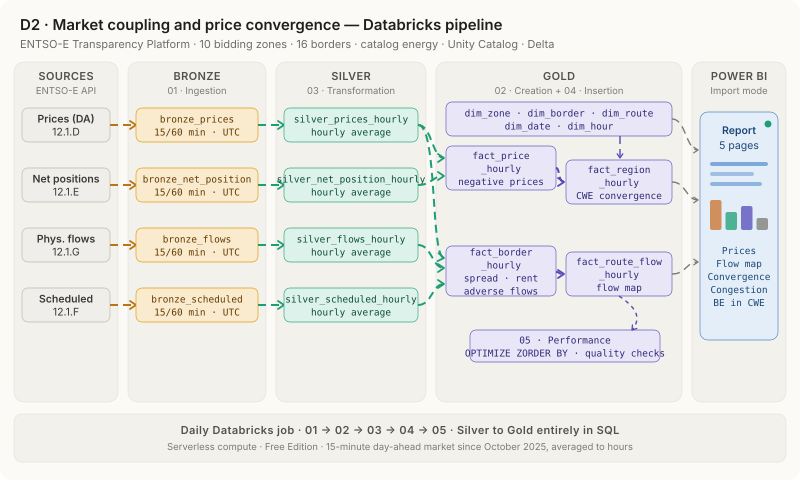

# Market Coupling and Price Convergence — Belgium in Central Western Europe

**ENTSO-E · Databricks · Unity Catalog · Delta Lake · Power BI**



## 1. Why and what?

Since the European day-ahead markets were coupled, two connected bidding zones get **the same price** as long as the
interconnector between them is not saturated. When it is, prices split: the spread is the signature of **congestion**,
and it creates a congestion rent for the grid operators. In Central Western Europe (Belgium, France, the Netherlands,
Germany-Luxembourg) capacity is allocated with the *flow-based* method, so physical flows can even go from the expensive
zone to the cheap one.

This project builds a data warehouse on Databricks that tracks, hour by hour, prices, net positions, cross-border
flows and scheduled exchanges for Belgium and nine other bidding zones, and exposes a star schema to a Power BI report.

Questions it answers:

* **How often does Belgium share the same price as its neighbours?** Convergence per border and for the whole CWE region.
* **Where and when are interconnectors congested, and what is it worth?** Spreads and estimated congestion rent.
* **Is Belgium importing or exporting, and from whom?** Net positions and a flow map of the net physical flows.
* **How often is Belgium the most expensive zone of the region?** Position of Belgium within CWE.

### The data

ENTSO-E Transparency Platform (free API key: https://transparency.entsoe.eu), accessed with `entsoe-py`:

* Day-ahead Prices (article 12.1.D)
* Net Positions, day-ahead (article 12.1.E)
* Cross-Border Physical Flows (article 12.1.G)
* Scheduled Commercial Exchanges, day-ahead (article 12.1.F)

Bidding zones: BE, FR, NL, DE-LU, AT, CH, CZ, PL, DK1, ES — 16 borders.

## 2. Setup

* Databricks Free Edition, serverless compute (environment version 4 or later).
* Unity Catalog catalog `energy`.
* ENTSO-E API key stored as a Unity Catalog secret: `energy.configschema.ENTSOE_API_KEY`.

## 3. Data warehouse

### 3.1 Medallion architecture

| Layer | Schema | Tables |
|---|---|---|
| Bronze | `energy.d2_bronze` | `bronze_prices`, `bronze_net_position`, `bronze_flows`, `bronze_scheduled` — raw ENTSO-E data (15 or 60 min, UTC) |
| Silver | `energy.d2_silver` | `silver_prices_hourly`, `silver_net_position_hourly`, `silver_flows_hourly`, `silver_scheduled_hourly` |
| Gold | `energy.d2_gold` | star schema below |

### 3.2 Star schema


* **Dimensions:** `dim_date`, `dim_hour` (Brussels local time), `dim_zone`, `dim_border` (one row per border A-B),
  `dim_route` (each border in both directions, with coordinates, for the flow map).
* **Facts:**
  * `fact_price_hourly` — price, net position and negative prices per zone and hour
  * `fact_border_hourly` — per border and hour: spread, convergence, congestion, net flow, net exchange, congestion rent, adverse flows
  * `fact_route_flow_hourly` — flow and exchange per direction, used by the flow map
  * `fact_region_hourly` — CWE convergence, number of distinct prices, position of Belgium

### 3.3 Notebooks

| Notebook | What it does |
|---|---|
| `01 - Ingestion` | Calls the ENTSO-E API for the selected period and writes the Bronze tables (re-runs create no duplicates). |
| `02 - Creation` | Creates the schemas, the dimensions (filled) and the fact tables (empty). |
| `03 - Transformation` | Bronze → Silver: hourly averages (the market moved to 15-minute periods in October 2025). |
| `04 - Insertion` | Silver → Gold, in SQL: prices, border facts, routes and CWE region. |
| `05 - Performance` | `OPTIMIZE … ZORDER BY`, row counts, duplicate keys and consistency checks. |

`01 - Ingestion` takes `start_date` and `end_date` (empty = last 7 days). A daily job runs `01 → 05`.

## 4. Definitions

For a border between zones $A$ and $B$ at hour $t$, with day-ahead prices $p_A$, $p_B$, net physical flow
$F_{A \to B}$ and net day-ahead scheduled exchange $S_{A \to B}$:

* **Convergence** — the two zones share the same price:

```math
\left| p_A - p_B \right| < 0.01 \ \text{€/MWh}
```

* **Estimated congestion rent** (an approximation: under flow-based allocation the actual rent is computed over the
  whole domain and published separately):

```math
R_{AB} = \left| p_A - p_B \right| \times \left| S_{A \to B} \right|
```

* **Adverse flow** — during a congested hour, the net physical flow goes from the expensive zone to the cheap one:

```math
\operatorname{sign}(p_A - p_B) \times F_{A \to B} > 0
```

* **Net position:** positive = net exporter, negative = net importer.
* **CWE price groups:** CWE prices are sorted each hour; a gap of at least 0.01 €/MWh between two consecutive prices
  starts a new group (SQL window function `LAG`).

## 5. Power BI

The report imports the `d2_gold` tables from the SQL warehouse. Relationships, DAX measures and the flow-map setup are
in `PowerBI_measures.md`.

Report pages: Price overview · Flow map · Convergence · Congestion · Belgium in CWE · Imports and exports.

<!-- Add screenshots of the report here, e.g.


-->

## 6. How to run it

1. Create a Unity Catalog catalog `energy` and a schema `configschema`.
2. Create the secret `energy.configschema.ENTSOE_API_KEY` (Catalog Explorer → *Create a new secret*) with your
   own ENTSO-E API key.
3. Import the five notebooks (or clone this repository as a Databricks Git folder).
4. Run them in order on serverless compute (environment version 4 or later, required to read Unity Catalog secrets).
5. Schedule a daily job `01 → 02 → 03 → 04 → 05` with empty dates: the last 7 days are reloaded every morning,
   which also picks up the revisions ENTSO-E publishes after the fact.

First load: run `01 - Ingestion` once with `start_date = 2024-01-01` (backfill), then let the job run daily.

## 7. Repository structure

```
├── 01 - Ingestion.ipynb
├── 02 - Creation.ipynb
├── 03 - Transformation.ipynb
├── 04 - Insertion.ipynb
├── 05 - Performance.ipynb
├── PowerBI_measures.md
├── images/
│   ├── d2_pipeline.svg              animated pipeline diagram
│   ├── d2_pipeline.gif              same diagram as GIF
│   ├── d2_relational_schema.png     star schema
│   └── d2_relational_schema.svg
└── README.md
```

---

Part of a series of ENTSO-E studies: D1 · Carbon intensity · **D2 · Market coupling** · D3 · Adequacy.

Data: ENTSO-E Transparency Platform. Author: Fadil Yvan Ouedraogo.

